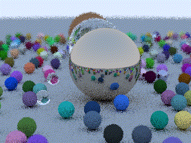

Ray Tracing Weekend
====================================================================================================

This is a project dedicated to learning the basics of C-based raytracing following the footsteps
laid in the _Ray Tracing in One Weekend_ book by Peter Shirley.

Currently it supports animations with variable camera positions:

Variable focus:

And variable aperture:

## The source code and the Book
The _Ray Tracing in One Weekend_ series of books are now available to the public for free in PDF
form, along with the accompanying source code. Releases are available [directly from GitHub], or
from Eric Haine's [Real-Time Rendering] site. Alternatively, you can purchase the Kindle version of
this series from [Amazon.com].

[Amazon.com]:           https://amazon.com/dp/B01B5AODD8
[directly from GitHub]:     https://github.com/petershirley/raytracinginoneweekend/releases/
[Real-Time Rendering]:  http://www.realtimerendering.com/#books-small-table
